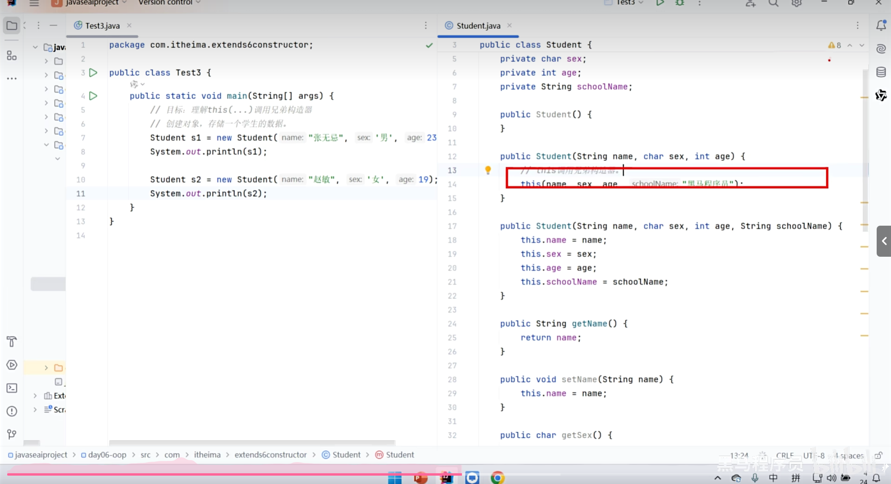

# Java基础
## Java入门
### 了解Java
1、Java是什么：

·Java是sun公司开发，现隶属于Oracle公司的一门高级编程语言。
2、Java之父：

·公认的Java之父是詹姆斯·高斯林。
3、Java能做什么：

·Java基本能够用于各个方面，主要用在企业服务端开发。
4、Java有哪三大使用平台：
·JavaSE（标准版）、JavaEE（企业版）、JavaME（小型版）。
### JDK的安装
·JDK:全称Java Development Kit。JDK包含了Java编译器、Java运行时环境（JRE）以及其它开发工具。我们可以在Oracle官网中下载适合自己的操作系统的JDK版本。

### Path环境变量的配置
·安装JDK之后，需要配置环境变量。主要是设置Java_Home和将JDK中的bin目录添加到系统的PATH中。这样我们就能够在系统任意位置运行Java命令了。
注：较新版本的JDK会自动配置环境变量。
### 开发“hello world”程序
·我们先编写一个文本文件，在其中输入一下代码，文件名称命名为：HelloWorld.java

    public class HelloWorld{
        public static void main(String[] args){
            System.Object.println("Hello world!");
        }
    }

·打开命令行所在端口，切换到.java文件所在的目录，输入命令：javac HelloWorld.java来编译这段代码，编译成功之后，会生成一个HelloWorld.class文件，
然后输入命令：java HelloWorld运行文件，我们就会得到代码的运行结果：Hello world!
### Java的跨平台原理
·一次编译，处处可用:原因是JVM的存在，java文件结果编译之后是在JVM中运行的，因此无论转到哪个系统，只有有对应的JVM就能够运行。

### Java编程工具的使用
·目前学习我们使用IDEA。
## Java程序的基本语法
### 功能单元--方法
·在java开发中，功能单元的最小形式是方法，我们用方法来完成开发者需要的一个个小的需求。
### 注释
·什么是注释：注释是写在程序中对代码进行解释说明的文字，方便自己和其它人查看，以便理解程序的。
·java注释有三种写法：
                 1、单行注释：只能写一行。
                 2、多行注释：可以写多行。
                 3、文档注释：通常用于类和方法的上方。
·注释的特点：不会影响程序的执行，结果编译之后的class文件中是没有注释的。
### 字面量
·什么是字面量：就是程序中能够直接书写的程序。
·字面量在程序中的书写格式：

            public static void printLiteral() {
                //整型字面量，直接打印
                System.out.println(10);
                //浮点型字面量，直接打印
                System.out.println(3.14);
                //布尔型字面量，只有true和false两种
                System.out.println(true);
                System.out.println(false);
                //字符型字面量，必须用单引号括起来，有且只能有一个字符
                System.out.println('A');
                System.out.println('中');
                //字符串型字面量，必须用双引号括起来，并且可以有多个字符
                System.out.println("Hello World");
                System.out.println("你好，世界");
                //特殊字符，/n可以换行
                System.out.println("Hello\nWorld");
            }

### 变量
·认识变量：变量就是内存中的一块区域，可以理解为一个盒子，用来存储程序要处理的数据的。
·定义格式：变量的数据类型  +  变量的名称  =  需要赋给变量的数据
·为什么使用变量：使用变量记要处理的数据，可以让编写的代码更加灵活，管理代码更加方便。
### 存储数据的原理：
·计算机内部使用二进制系统来表示和处理数据。二进制系统只有两个状态：0和1，对应于电子电路中的低电平和高电平。
·二进制：只有0和1，按照逢二进一的格式处理数据。
·除了二进制之外，为了方便处理一些数据，我们还需要对八进制和十六进制有所了解。关于进制转化的内容自己去练习就行。
·字符数据在计算机中怎么存储：字符在计算机中有规定对应的ASCII编码表，编码对应是有数值的，在计算机中数值又转化为二进制来处理。
·图片数据是如何存储的：图片是由无数个像素点储存的，每个像素点我们可以用数据表示其颜色，然后在计算机中通过二进制进行存储使用。
·声音数据是如何存储的：声音是有波形的，波形图被二进制形式存储后，在计算机中就能够被存储了。
### 数据类型
·java中的数据类型分为基本数据类型和引用数据类型。
·基本数据类型有八种，整型：byte、short、int、long，浮点型：float、double，字符类型：char，布尔类型：boolean

    public static void printDataType() {
        //学习java中的基本数据类型，这些数据类型所占用内存的大小是不同的。
        //整型数据类型
        byte b = 127;//一个字节，8个比特位，-128~127
        short s = 32767;//两个字节，16个比特位，-32768~32767
        int i = 2147483647;//四个字节，32个比特位，-2147483648~2147483647
        long l = 9223372036854775807L;//八个字节，64个比特位，-9223372036854775808~9223372036854775807
        //浮点型数据类型
        float f = 3.14F;//四个字节，32个比特位
        double d = 3.14;//八个字节，64个比特位
        //字符型数据类型
        char c = 'A';//一个字节，8个比特位
        //布尔型数据类型
        boolean bool = true;//一个字节，8个比特位
    }

### 关键字和标识符
·关键字:是指被编程语言本身预留的具有特殊意义的单词，它们被用于定义程序的结构、控制流程或者数据类型等等，关键字是不能用来作为变量名、方法名或者其它标识符的。
·标识符：是程序员自定义的名称，用来给变量、方法、类、包等命名，数字不能用于标识符的开头；标识符区分大小写；标识符不能与关键字重名。
### 方法的基本语法
·方法是什么：方法是一种用于执行特定任务或操作的代码块，代表一个功能，它可以接收数据进行处理，并返回一个处理后的结果。
·方法的完整定义格式：
    修饰符  返回值类型  方法名(形参列表){
        方法体代码（需要执行的功能代码）
        return 返回值;
    }
举例：

    public static int max(int a,int b){
        int max=(a>b)?a:b;
        return max;
    }

·方法必须被调用才能得到执行，调用格式：方法名(参数)。
·返回值类型和返回值息息相关，如果一个方法没有返回值，那么应该定义为void类型。还有需要注意的点是：不是所有方法都需要接收参数的。
### 方法的一些注意事项
·方法是可以重载的，一个类中，出现多个方法名相同的方法，但是参数列表不同那么这些方法就称为方法重载了。
·无返回值的方法中可以通过单独的return语句来结束当前方法的执行。
### 类型转换
·简单数据类型转换
    1、低级到高级的自动类型转换：
        ·低级变量可以直接转换为高级变量，而不会丢失精度。
    2、高级到低级的强制类型转换：
        ·强制类型转换格式：变量名称=（要转换的数据类型）+变量名称。
        ·强制类型转换会导致数据溢出或者精度丢失。

### 输入输出
·输出：System.out.println语句可以输出内容。
·输入：Java中的输入需要用Scanner类，Scanner sc=new Scanner(System.In)，然后调用sc.next()方法就可以实现输入数据。

    public static void main(String [] args){
        Scanner sc=new Scanner(System.in);
        int index=sc.nextInt();
        System.out.println(index);
    }
这个代码就能实现输入一个值并且打印。
### 基本运算符
·自增自减运算符：++，--。需要注意的是自增自减运算符的位置在前是先自加/减再参加运算，反之先参加运算再自加/减。
·赋值运算符：=。作用就是赋值。
·三元运算符：(表达式)？数值1：数值2。表达式为true则取数值1，如果表达式为false则取数值2。
·逻辑运算符：&&、||、!。
    且表示两个数值都为true则取true，否则为false。
    或表示有一个数值为true则为true，两个都为false则取false
    非表示取数值的相反值，数值为true则取false，反之取true。
### 分支结构
·if分支：根据条件的真或假来决定执行某段代码。
    假设我们在开发一个汽车自动驾驶的项目，请问该项目怎么让汽车安全的通过红绿灯入口：

    public static boolean passOrNot(String color) {
        if(color.equals("red")){
            System.out.println("红灯停！");
            return false;
        }else if(color.equals("yellow")){
            System.out.println("黄灯请注意！");
            return false;
        }
        else if(color.equals("green")){
            System.out.println("绿灯行！");
            return true;
        }else{
            System.out.println("输入错误！");
            return false;
        }
    }
这就是典型的if分支结构，选择满足条件的一个分支去执行。
·switch分支：通过比较值是否相等来决定执行哪个分支。

    public static void test_switch(String color) {
        switch(color){
            case "red":
                System.out.println("红灯停！");
                break;
            case "yellow":
                System.out.println("黄灯请注意！");
                break;
            case "green":
                System.out.println("绿灯行！");
                break;
            default:
                System.out.println("输入错误！");
        }
    }
这一个典型的switch结构，语法格式就是在switch之后输入需要配比的变量，根据值是否相等来执行代码。
注意：switch分支具有穿透性，我们可以通过穿透性来合并一些分支，避免重复代码过多。比如在这个例子中，假设去掉红灯停黄灯请注意的输出，red和yellow
返回的结果是相同的，都是false，那么我们可以把red分支中的语句去掉，在yellow分支中输出"要等绿灯才能通过！"并且break，这样输入red和yellow也能够
得到正确的结果。
### 循环结构
·for循环：
    需求：求1~5之间的数据和，并把求和结果在控制台输出。

    public static void test_for(){
        int result=0;
        for(int index=1;index<6;index++){
            result+=index;
        }
        System.out.println(result);
    }
这是一简单的for循环结构，在使用for循环的时候一定要注意循环的临界条件，避免出错。
·while循环：
    需求：世界上的最高峰珠穆朗玛峰是8848.86米，一张厚度为1毫米的纸，折多少次能够到达珠穆朗玛峰的高度？

    public static void test_while(){
        int height=1;
        int times=0;
        while(height<8848860){
            height*=2;
            times++;
        }
        System.out.println("需要折叠"+times+"次才能到达珠穆朗玛峰的高度。");
    }
这是一个典型的while循环结构，当满足条件的时候循环就会运行，所以我们要仔细研究问题，判断循环的开始和结束条件。
·do-while循环
    do-while循环和while循环很像，区别在于do-while循环是先执行再判断条件，while循环则是先判断条件是否满足再进行循环。
·循环嵌套：
    案例：利用代码输出九九乘法表。

    public static void test_Nesting(){
        for(int rows=1;rows<=9;rows++){
            for(int columns=1;columns<=rows;columns++){
                System.out.print(rows+"*"+columns+"="+rows*columns+" ");
            }
            System.out.println();
        }
    }
这就是简单的循环嵌套的使用，很多问题中，单个的循环并不能够解决问题，需要用到循环的嵌套，比如九九乘法表的打印，利用循环嵌套我们可以简单的将九九
乘法表打印出来，如果一个输出就会很麻烦了。
### 跳转关键字
·break：跳出并结束当前所在循环的执行。
·continue：用于跳出当前循环的当次执行，直接进入下一次循环。
### 数组
·数组是一种存储固定大小的相同类型元素的容器。数组中的元素可以通过索引访问，索引从 0 开始。
#### 一维数组
    一维数组的初始化：
    1、静态初始化：在声明数组的同时指定数组的元素。
             数据类型[] 数组名 = {元素1, 元素2, ..., 元素n};

    public static void staticInit(){
        int[] arr = {1,2,3,4,5};
        for (int i = 0; i < arr.length; i++) {
            System.out.println(arr[i]);
        }
    }

    2、动态初始化：先声明数组变量，然后使用 new 关键字创建数组对象，并指定数组的长度。
             数据类型[] 数组名 = new 数据类型[数组长度];

    public static void dynamicInit(){
        int[] arr = new int[5];
        for (int i = 0; i < arr.length; i++) {
            arr[i] = i * 2;
        }
        for (int i = 0; i < arr.length; i++) {
            System.out.println(arr[i]);
        }
    }

    一维数组的遍历：

    public static void arrayTraversal(){
        int[] arr = {1,2,3,4,5};
        for (int i = 0; i < arr.length; i++) {
            System.out.println(arr[i]);
        }
    }

#### 二维数组
    二维数组的初始化：
    1、静态初始化：

    public static void staticTwoDimensionalArray(){
    int[][] arr = {{1,2,3},{4,5,6},{7,8,9}};
    //二维数组的元素个数
    System.out.println(arr.length);
    //二维数组的行数
    System.out.println(arr[0].length);
    }

    2、动态初始化：

    public static void twoDimensionalArray(){
    int[][] arr = new int[3][4];
    //二维数组的元素个数
    System.out.println(arr.length);
    //二维数组的行数
    System.out.println(arr[0].length);
    }

    二维数组的遍历：

    public static void arrayTraversal()
    {
        int[][] arr = {{1,2,3},{4,5,6},{7,8,9}};
        for(int i = 0; i < arr.length; i++)
        {
            for(int j = 0; j < arr[i].length; j++)
            {
                System.out.print(arr[i][j] + " ");
            }
            System.out.println();
        }
    }

## 面向对象——Java编程的核心套路
### 了解对象
·什么是对象：对象是一种特殊的数据结构，用来存储一个事物的数据，从而可以代表该事物。
    ·声明一个对象，并且设置其属性，我们就可以得到一个在代码中能够代表某事物的综合变量。
     当然这只是一种说法，但是这就是对象代表的意义。

·怎么获取一个对象：
    1、先设置对象的模板，也就是对象的设计图——类：
    
    public class star {
    String name;
    int age;
    double weight;
    double height;
    }
这就定义了一个类，类是对象的模板，每一个对象都会有类中定义的所有属性，是对象的
抽象化，而对象则是在类的模板上给以具体数据的具体实现。
    2、创建对象
    public static void main(String[] args) {
        star star1=new star();
        star1.name="赵丽颖";
        star1.gender='女';
        star1.age=27;
        star1.weight=55.5;
        star1.height=1.65;
        System.out.println(star1.name+" "+star1.gender+" "+star1.age+"岁 "+star1.weight+"公斤 "+star1.height+"m ");
    }
这里我们就通过star类创建出了一个star对象，并且给star对象赋予了具体的数据。
    3、对象方法
    在类这个模板中，对象们不仅仅有类同的属性，也会有类同的行为，比如动物们都会去觅食，
    比如学生们都会上课，比如明星都会参加商演活动，我们依此在类的模板中可以写一些方法，
    方便使用对象的时候实施这些类同的行为。

    public class student {
        String name;
        double chinese;
        double math;

        public double getSum()
        {
            return chinese + math;
        }

        public double getAverage()
        {
            return getSum() / 2;
        }
    }

    public static void main(String[] args) {
        student student1 = new student();
        student1.name = "波妞";
        student1.chinese = 100;
        student1.math = 100;
        student student2 = new student();
        student2.name = "波仔";
        student2.chinese = 90;
        student2.math = 80;
        System.out.println(student1.name + "的分数是：" + student1.getSum() + "，平均分是：" + student1.getAverage());
        System.out.println(student2.name + "的分数是：" + student2.getSum() + "，平均分是：" + student2.getAverage());
    }//在这个方法中我们就成功使用了类中定义的方法来获取对象波妞和波仔的总分和平均分。
·对象在计算机中是什么：在研究完对象的一些使用方法之后，我们回过头来看一下，在已经知道
对象是一种特殊的数据结构的基础上，我们来思考一下，在计算机的底层中，对象是什么？
    当我们运行一个java程序时，实际上我们是在电脑的内存中的JVM中运行代码，而为了更好的
    执行代码，JVM把内存分为了三个区块，栈内存、堆内存和方法区。
    平时我们的类文件信息都是放在方法区的，在方法区中访问到main()方法之后，JVM会把main()
    方法放到栈内存去执行。
·总结：万物皆对象，谁的数据谁存储。
### 面向对象的基本语法
#### 类的成分——构造器
·类中没有返回值类型，方法名必须与类名一致的方法称为构造器。
·构造器的特点：
    1、创建对象的时候，对象会去自动调用构造器。
·构造器的常见应用场景：
    1、创建对象时，同时完成对对象成员变量（属性）的初始化赋值。
·构造器的注意事项：
    1、类默认就自带了一个无参构造器。
    2、如果为类定义了有参构造器，那么类自带的无参构造器就没有了，此时如果还想要
    调用无参构造器，需要自己手动写一个。
#### this关键字
·this关键字：this就是一个变量，可以用在方法中，来拿到当前的对象；哪个对象调用方法，
 this就会指向哪个对象。
·this拿到的是当前对象的地址。比如我们在类中直接声明一个方法，方法的作用就是打印this

    public static void main(String[] args) {
        //目标：认识this关键字，搞清楚this关键字的应用场景。
        Graduate gra=new Graduate();
        gra.show();
        System.out.println("--------");
        Graduate gra2=new Graduate();
        gra2.show();
    }
 那么结果就会打印出两个不一样的地址，分别代表对象gra和gra2的地址。
·this的常见应用场景：用于解决变量名称冲突的问题。下面来看一个案例：

    String name;
    int age;
    double score;

    public void show(){
        System.out.println(this);
    }

    public void print(String name){
        System.out.println(name+"喜欢"+name);
    }
    //这是一个对象类中的内容。name是传入的对象喜欢的事物的名称，因为在使用变量时，
    //我们要尽量做到见面知义，所以我们命名为name，那么我们来使用一下这个方法：

    Graduate gra2=new Graduate;
    gra2.name="赵丽颖"
    gra2.show();
    gra2.print("小花");
    //最后输出的结果是小花喜欢小花，这是因为name和类中的属性重复，在方法中，name会
    //代表传入的数据，而不会指向当前对象的属性，这时候我们就需要使用this来避免这种情
    //况的出现。

    public void print(String name){
        System.out.println(this.name+"喜欢"+name);
    }
    //输出的解果就会是赵丽颖喜欢小花，这也是我们想要得到的结果。
    
    需要注意的是，在我们写有参构造器的时候，往往就会碰到像上面这种情况，我们总不能往
    该是name的地方换个别的变量名称，因此这时候使用this关键字就是一个便捷的操作了。
#### 封装
·封装是面向对象的三大特征之一：封装、继承、多态。
·类就是一种封装。
·封装的设计要求：合理隐藏、合理暴露。
    现在我们来看一个实例：

        public class Student {
            //学习封装
            String name;
            int age;
            double chinese;
            double math;

            public void Student(String name,int age,double chinese,double math){
                System.out.println("有参构造方法");
            }
        }
        //这是一个student类，我们创建一个对象之后，可以随意的给这个对象赋值属性，比如
        //给age赋值为-1，但是这显然不符合现实情况，为了避免这种可能出现违规的赋值，我们
        //选择对类中的某些进行合理隐藏。

        public class Student {
            //学习封装
            private String name;//用关键字对name进行处理，之后name属性只能在Student类中被直接访问。
            int age;
            double chinese;
            double math;

            public void Student(String name,int age,double chinese,double math){
                System.out.println("姓名:"+name+"年龄:"+age+"语文成绩:"+chinese+"数学成绩:"+math);
            }
        }//这就是合理隐藏的方法。

    接着我们来学习怎么实现合理暴露。
        因为隐藏之后，被隐藏的属性只能在本类中被直接访问，在其它的类中都不能被直接访问，
        我们选择在本类中设计方法，实现合理暴露。

        public void getName(){
            System.out.println("姓名:"+name);
        }
    
        public void setName(String name){
            this.name=name;
        }
        //通过这两个方法，我们就可以在别的类中合理访问到被隐藏起来的name属性了。
        //同时在这两个方法中我们可以对传入的数据进行判断，如果合法我们就使用，不合法就
        //打回。
    总结：封装的设计规范是合理隐藏，合理暴露。在代码层面，我们通过使用public和private
    关键字对成员进行修饰，从而达到隐藏/暴露的目的。
#### 实体类——JavaBean
·实体类是一种特殊类，类中要满足一下要求：
    1、类中的成员变量全部私有，并且提供public修饰的getter和setter方法。
    2、类中需要提供一个无参数构造器，有参数构造器可选。

    public class Student {
        private String name;
        private int age;
        private double chinese;
        private double math;

        public String getName() {
            return name;
        }

        public int getAge() {
            return age;
        }

        public double getChinese() {
            return chinese;
        }

        public double getMath() {
            return math;
        }

        public void setName(String name) {
            this.name = name;
        }

        public void setAge(int age) {
            this.age = age;
        }

        public void setChinese(double chinese) {
            this.chinese = chinese;
        }

        public void setMath(double math) {
            this.math = math;
        }
    }//这就是一个实体类了，是一个用来保存数据的java类，可以用来创建对象，保存某个事物的
    //数据。
    实体类的主要应用场景：实体类对应的是软件开发中比较流行的开发方式，数据和数据的业务
    处理相分离。
#### static关键字
·静态，可以用来修饰成员变量、成员方法。
·成员变量按照有无static修饰分为两种：
    1、静态变量（类变量），在计算机中只有一份，会被所有对象共享。
    2、实例变量（对象的变量），属于所有对象的。
    举例：

    public class Student{
        static int totalStudents;
        int age;
    }//age是每个对象都会有的，且对象的age可能是不同的，所以我们不用static修饰，
    //但是学生总人数，对于每一个对象来说学生总人数的数据是不变的，所以只用一份副本
    //去存储即可。
·成员方法：
    1、静态方法
        ·通过类名直接调用，也可以通过对象调用（但推荐使用类名）。
        ·只能访问静态变量和静态方法。
        ·不能访问实例变量和实例方法。
        ·生命周期与类的生命周期一致。
    2、实例方法
        ·需要通过对象调用。
        ·可以访问实例变量和静态变量。
        ·可以调用其他实例方法和静态方法。
        ·生命周期与对象的生命周期一致。
    3、静态方法的一些注意事项：
        ·不能访问非静态成员，如果要访问实例变量，建议使用实例方法。
        ·不能使用this和super关键字，因为this和super关键字都和当前对象有关，而静态
         方法不属于任何对象。
        ·不要过度使用静态方法，会导致代码难以维护。
#### 继承
##### 认识继承：
1、什么是继承：java中提供了一个关键字：extends，用这个关键字，可以让一个类和另外
一个类建立起父子关系。

        public class B extends A{

        }//A类称为父类（基类或者超类）
2、继承中子类能够得到：
·父类的非私有成员（包括成员变量和成员方法）
3、继承后对象的创建是由子类和父类共同完成的。子类创建的实例对象，实际上是由子类和父类两张设计图一同创建的。
4、继承的好处：代码复用，减少了重复代码。
##### 认识权限修饰符
作用：用来修饰类中成员能够被访问的范围
1、private：只能在本类中被访问
2、public：任意位置都可
3、protect：本类，同一个包中的类、子孙类都可
4、缺省（就是不给修饰符的默认状态）：本类以及同一个包中的类
##### 继承的特点：
1、单继承：Java是单继承模式，一个类只能继承一个直接父类。
2、多层继承：Java不支持多继承，但是支持多层继承，也就是一个类只能有一个直接父类，但是能够有爷爷类，祖爷爷类......。
3、祖宗类：Java中的所有类都是Object类的子类。
4、就近原则：优先访问自己类中，自己类中没有的才会访问父类。（子类中访问成员就使用就近原则：子类没有找父类，父类没有就报错。）
如果子父类中出现了重名的成员此时一定要在子类中使用父类的成员，那么就使用super关键字。
##### 方法重写：
1、方法重写是什么：当子类觉得父类中某个方法不好用或者说无法满足子类中需求的话，子类可以重写一个方法名称、参数列表一样的方法这个就叫做重写。
2、方法重写的返回值类型要么相同，要么子类重写的方法的返回值类型在层级上更小。
3、私有方法、静态方法是不能重写的，不然会报错。
4、子类重写方法的时候，重写方法的访问权限必须大于或者等于父类中该方法的权限。
总结来看，重写要满足：声明不变，重新实现。
5、方法重写的常用场景：
·子类重写父类的toString方法，以便返回对象的内容。
在实际代码中，当我们创建一个实例，直接输出这个对象实例的时候，会出现一串所谓的地址。实际上，我们打印这个对象的时候，是调用了对象继承自Object
类的toString()方法，只不过toString()我们可以省略不写。我们输出一个对象，往往是希望获得该对象的内容，输出该对象的地址是没有什么意义的，所以
子类需要重写Object的toString()方法，以便输出对象时就近调用子类重写的toString方法来返回对象的内容。
注意：父类重写之后，子类会自动继承重写的toString()方法。
##### 子类构造器的特点
1、子类所有的构造器，都必须先调用父类的构造器，再执行自己。默认会调用父类的无参构造器，如果父类没有或者private修饰了，那就使用super调用父类的
其它构造器。
2、如果父类没有无参构造器，我们必须在子类的第一行用super关键字调用父类的有参构造器。
3、子类构造器默认第一行就有一个super()，默认存在，写不写都有的。
4、为什么要先调用父类的呢？

    截图中，我们可以发现，传入对应数据之后，子类teacher中只能把子类独有的skill类赋值，而其它对象属性实际是在父类当中，所以必须访问父类才能给对应
    继承来的属性进行处理。

    这也就是子类构造器调用父类构造器的常见应用场景。

##### this调用兄弟构造器
this关键字的作用是构造器中调用本类的其它构造器。

注意：无论是super调用父类构造器还是this调用兄弟构造器，都只能出现在构造器代码中的第一行，而且，二者不能同时出现。
原因：
    1、保证初始化顺序的正确：Java 要求对象的初始化必须按照一定的顺序进行。super 用于调用父类的构造器，而 this 用于调用当前类的其他构造器。这两个
    关键字确保了在对象完全初始化之前，先调用父类的构造器或当前类的另一个构造器。
    2、避免重复调用：如果允许 this 或 super 在构造器中的任意位置出现，可能会导致多次调用构造器，从而引发重复初始化的问题。
    3、语法规范：Java 语言规范明确规定了这一点，以确保代码的可读性和一致性。
#### 多态
##### 认识多态
1、什么是多态：多态是一种在继承/实现情况下的一种现象，具体表现为：对象多态和行为多态。
比如，猫和狗都继承自动物这个父类，我们可以直接声明一个动物对象为猫，也可以直接声明为狗。

    Animal animal1=new Cat();
    Animal animal2=new Dog();
这样声明出来的两个对象，实际上一个是猫的实例一个是狗的实例，这就是对象多态。
那么什么是行为多态呢？

    animal1.roar();
    animal2.roar();
猫的叫声就是喵喵喵，狗的叫声就是汪汪汪，两个对象都调用roar方法，表现却不同，这就是行为多态。
注意：在多态中，关于对象多态和行为多态，原则是编译看左边，运行看右边，但是注意，多态现象并不包含成员变量，所以关于成员变量，编译和运行都看左边
（左边就是指父类，右边指多态的子类）。多态是对象和行为的多态，与其它无关！
2、多态的前提：
    ·有继承/实现关系，存在父类引用子类对象，存在方法重写。
    父类引用子类对象就实现了对象多态，方法重写就实现了行为多态。
##### 多态的好处
1、在多态形式下，右边的对象是解耦合的，更利于扩展和维护。
2、定义方法时，使用父类的形参，可以接收一切子类对象，扩展性更强，更加便利。
但是多态下会产生一个问题：多态下无法使用子类的独有功能。
##### 多态下的类型转换
1、多态下类型转换有两种形式：
    ·自动类型转换：父类 变量名=new 子类();
    ·强制类型转换：子类 变量名=(子类)父类变量----强制类型转换可以解决多态下无法使用子类的独有功能的问题。
2、强制转换需要注意什么：
    ·存在继承或者实现的时候，就可以进行强制类型转换，编译阶段不会报错。
    ·运行时，当对象的实际类型与强转类型不一致会报错。（instanceof关键字可以判断对象实际类型）
#### 面向对象高级
##### final关键字
1、认识final关键字：final可以修饰类、方法和变量
    ·修饰类：该类被称为最终类，特点是该类不会再被继承。
    ·修饰方法：该方法被称为最终方法，特点是无法再被重写。
    ·修饰变量：该变量有且只能被赋值一次。：
        修饰静态成员变量：fina修饰静态变量，这个变量今后被称之为常量，可以记住一个固定的值，并且程序中不能修改了，通常这个值作为系统的配置信息。常量名称建议大写，多个单词用下划线连接。
        修饰实例成员变量：一般没有意义，一般也不用final修饰实例成员变量。
2、什么时候用final关键字：
    举例1：工具类，比如在之前练习的加油站板块中，我们需要一个工具类存储用来保存已经建立了的对象的数组，工具类基本没有创建对象的必要性，所以用private修饰它的构造器，也可以用final修饰工具类，因为工具类没有被继承的必要。
扩展——常量：用static final修饰的成员变量就是常量，作用：用于记录系统的配置信息。
使用常量的好处：代码可读性会更好，可维护性也更好。程序编译之后，常量会被宏替换：出现常量的地方会全部被替换成其记住的字面量，这样可以保证使用常量和使用
##### 单例类（设计模式）
1、什么是设计模式：一个问题有n中解法，其中最优秀的解法被总结出来了，就称之为设计模式。
2、设计模式有二十多种，对应二十多种软件开发中会遇到的问题。
3、关于设计模式，我们要学习的是：设计模式解决了什么样的问题，设计模式应该怎么写。
4、单例设计模式：
    ·作用：确保某个类只能创建一个对象。
    ·写法、实现步骤：把类的构造器私有；定义一个类变量记住类的一个对象；定义一个类方法返回对象。
    
    
上面的这种单例设计被称为饿汉式单例，就是在拿对象的时候对象已经创建好了。

这是懒汉式单例，拿对象时候才创建对象。
##### 枚举类
1、枚举类是什么：枚举类是一种特殊的类，它的写法如下：

    修饰符 enum 枚举类名{
        对象名1，对象名2，对象名3，......;
        其它成员;
    }
特点：
枚举类中的第一行，只能写枚举类的对象名称，且用逗号隔开。
这些名称本质是常量，每个常量都记住了枚举类的一个对象。
2、枚举类的应用场景：枚举类很适合做信息分类和标志。
比如：一个对象根据场景属性的不同有不同的行为，我们就可以写一个参数为枚举类对象的行为方法，
这样写出来的代码会更加清晰和安全。
##### 抽象类
1、抽象类是什么：
    ·Java中有一个关键字是abstract，表示抽象的意思，可以用它修饰类和成员方法。
    ·用abstract修饰的类就是抽象类，用abstract修饰的方法就是成员方法。
2、抽象类的注意事项和特点：
    ·抽象类中不一定有抽象方法，有抽象方法的一定是抽象类。
    ·类有的构造方法、成员变量、成员方法等，抽象类都可以有。
    ·抽象类最主要的特点是不能创建对象，仅仅作为一个特殊的父类模板，被子类继承。
    ·一个类继承抽象类，一定要重写所有继承来的抽象方法，否则这个类必须也定义为抽象类。
3、使用抽象类的好处：
    ·父类知道子类都会做某种行为，但是每个子类做这种行为的具体实现又不一样，父类就定义一个抽象
    方法让每个子类去继承重写。这样设计的目的就是为了更好的支持多态。
4、模板方法设计模式：
    ·提供某类方法作为完成某类功能的模板，模板方法封装了每个实现步骤，但允许子类提供特有步骤的
    实现。
    ·模板方法设计模式可以提高代码的复用，并简化子类设计。
    
    
    就是把子类的特有步骤抽象出来，把相同的代码行为抽象出来做模板方法。
    
##### 接口
1、接口的概述：
    ·Java中提供了一个关键字interface定义出接口。
    ·接口不能创建对象。
    ·接口是用来被实现（implements）的，实现接口的类称为实现类，一个类可以实现多个接口。
    
2、使用接口的好处：
    
    面向接口编程可以实现灵活切换实现方案。
3、JDK8之后接口新增的3种方法：
    
4、接口的注意事项：
    
5、抽象类和接口的区别：
##### 代码块
    1、静态代码块
    
    2、实例代码块
    
##### 内部类
1、什么是内部类：
    
2、成员内部类：
    
    
3、静态内部类：
    
4、局部内部类：
    
5、匿名内部类：

##### 函数式编程
##### 常用API
##### GUI编程

     

